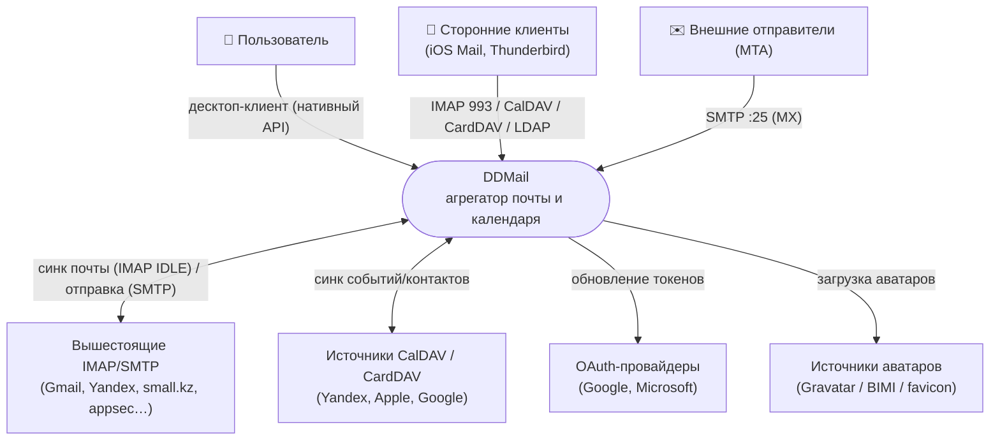
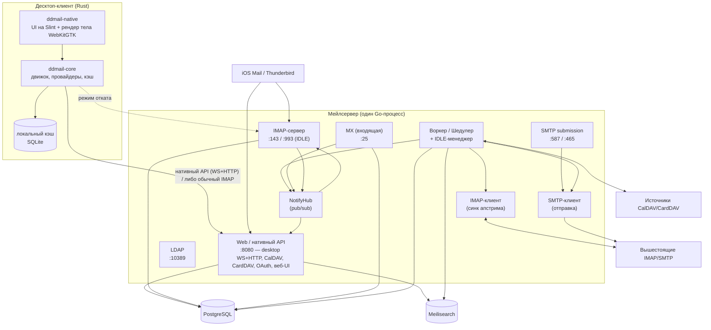
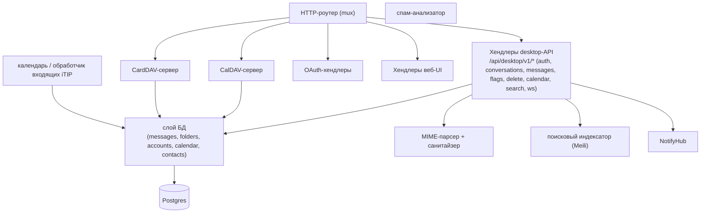
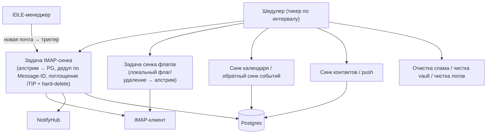
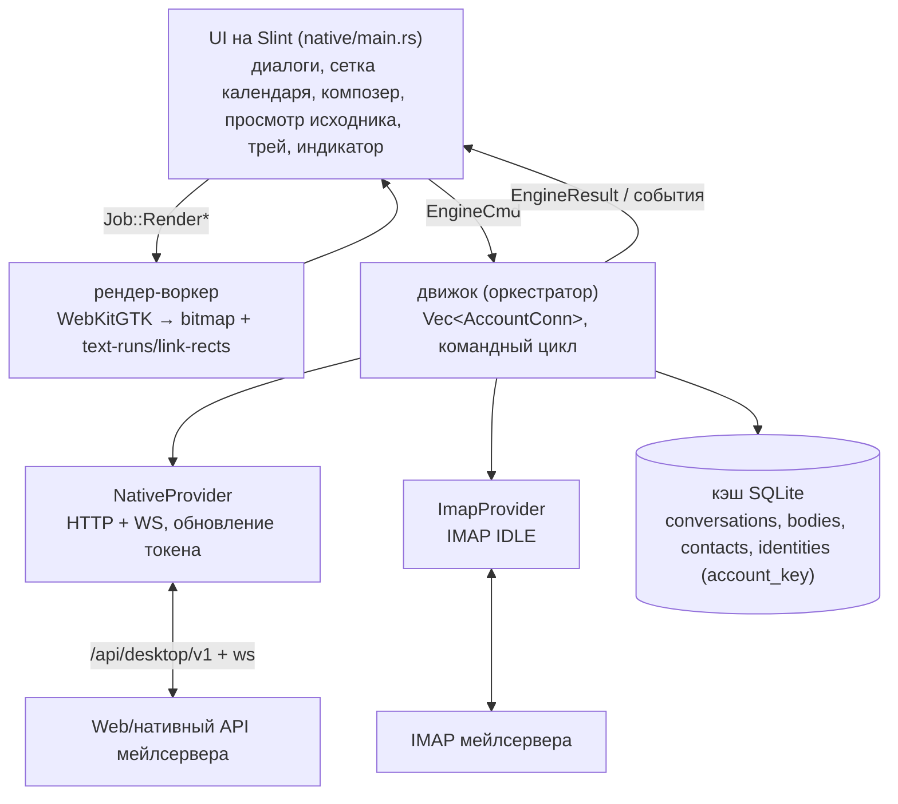

# DDMail — Архитектура C4 (уровни 1 / 2 / 3)

Снимок на 2026-06-17. Диаграммы Mermaid (рендерятся в Typora, на GitHub, в любом Mermaid-вьювере).
DDMail — это self-hosted **агрегатор почты + календаря/контактов** с
Telegram-подобным десктоп-клиентом. Один Go-бинарь зеркалит несколько
вышестоящих IMAP/CalDAV/CardDAV-аккаунтов в Postgres и отдаёт их заново
по IMAP/SMTP, нативному desktop-API (WS + HTTP), CalDAV, CardDAV и LDAP.
Десктоп-клиент на Rust/Slint общается по нативному API (с откатом на обычный IMAP).

---

## Уровень 1 — Контекст системы

---

## Уровень 2 — Контейнеры

Примечания:
- «Мейлсервер» — это **один процесс**; боксы — это параллельные слушатели/сервисы, разделяющие БД + NotifyHub, а не отдельные деплои.
- NotifyHub разводит push-события на **два потребителя**: desktop-WebSocket (`webapi`) и IMAP IDLE (`imaps`). См. «Несущие решения», п. 5.

---

## Уровень 3 — Компоненты

### L3a — Мейлсервер: контейнер Web / нативный API

### L3b — Мейлсервер: воркер + синк

### L3c — Десктоп-клиент

---

## Несущие решения и их статус

Тревога была обоснована: всё трение сводилось к идентичности письма. Приняты
твёрдые архитектурные решения и заложен фундамент.

### Решено и реализовано

1. **Идентичность письма = `(user_id, Message-ID)`.** ✅ *Реализовано.*
   Глобальный естественный ключ. Сервер **не переидентифицирует** зеркалируемую
   почту и **никогда не генерирует** Message-ID. Гарантируется на уровне БД
   частичным уникальным индексом `messages_user_message_id_uq` (только для
   непустых message_id — локальные черновики без заголовка не конфликтуют).
   `CreateMessage` → `INSERT … ON CONFLICT (user_id, message_id) DO NOTHING`
   (`ErrDuplicateMessage` = доброкачественный пропуск).
   *Миграции 041 (дедуп + UNIQUE) → 042 (частичный индекс).*

2. **Ингресс без Message-ID отвергается.** ✅ *Реализовано.*
   MX → явная ошибка `5xx` (bounce); IMAP-синк апстрима → пропуск + лог.
   Это убрало оба генератора «синтетических» id, которые и плодили чурн.

3. **desktop-контракт опирается на стабильный id.** ✅ *Реализовано.*
   `DesktopMessageRef` несёт `message_id`; тело/флаги/удаление/спам резолвятся
   через `resolveMsgRef` по `(user_id, Message-ID)` с фолбэком на волатильный
   `uid` (= `messages.id`) для старых клиентов. Клиент (Rust) прокидывает
   `message_id` во все refs и кэширует по нему. Это и был корень «пустых тел /
   зависших диалогов» (висячий `messages.id` после delete+reinsert).

### Решено и реализовано (продолжение)

4. **Журнал изменений (Kafka-style) вместо полного ресинка.** ✅ *Реализовано.*
   Таблица `message_changes(seq BIGSERIAL, user_id, message_id, kind, ts)`,
   наполняется **триггером БД** на `messages` (INSERT/UPDATE/DELETE) — единый
   источник истины, ни один путь приложения не может забыть записать событие.
   UPDATE-триггер сужен до видимых клиенту колонок (флаги / папка / видимость),
   чтобы не шуметь на бэкфилле тел. `kind=2` (delete) когда строка уходит из
   видимости (deleted/soft_deleted/is_spam). Клиент хранит глобальный курсор
   `seq` и дочитывает хвост `GET /changes?since=seq` → `{entries, latest_seq,
   low_watermark, reset}`; применяет DELETE-tombstone'ы к кэшу до дельты.
   `reset` (новый клиент / курсор отстал за retention) → полный ресинк +
   принять `latest_seq`. Компакция — раз в сутки, retention 30 дней (как vault).
   *Миграция 043; задеплоено и проверено на проде (триггер пишет, эндпоинт
   отдаёт reset/хвост).* **Это и есть замена «ресинка раз в 24ч» — теперь у
   дельты есть явная семантика удалений.**

### Закрыто журналом

5. **Веер уведомлений стал надёжным.** ✅ Удаления публикуются в NotifyHub, а
   главное — журнал (п.4) делает доставку событий **сверяемой**: клиент не
   доверяет одному пушу, а дочитывает хвост по `seq` при любом триггере
   (коннект / WS-событие / периодика), так что пропущенный пуш ловится на
   следующей сверке. WS-пуш теперь лишь «звонок будильника», истина — в журнале.

### Сознательно принятые рамки (не «скрип», а решения)

- **Зеркалирование в Postgres — оставляем.** Это и есть модель агрегатора;
  чурн id убирается стабильным ключом (п.1), а не отказом от зеркала.
- **Нативный протокол — оставляем.** IMAP «мал» для клиента (календарь,
  диалоги). Дуальный режим (native ⇆ обычный IMAP) — не проблема: каждый
  сервер-источник либо ddmailserver-native, либо IMAP IDLE, третьего нет.

**Вывод:** топология для агрегатора верная; фундамент идентичности **и журнал
изменений** заложены и задеплоены. Все пять точек трения из первоначальной
оценки закрыты решениями (п.1–4 реализованы, п.5 закрыт журналом). Дальше —
фичи на стабильном контракте, а не починка фундамента.
