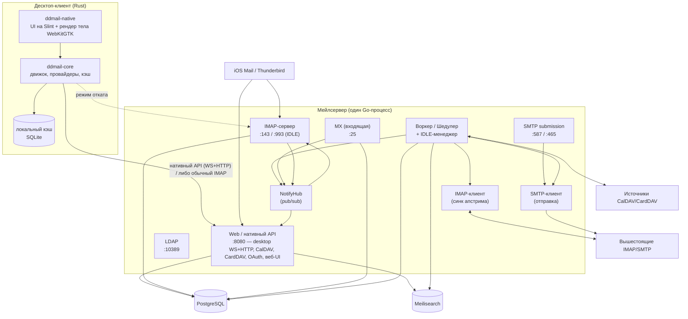
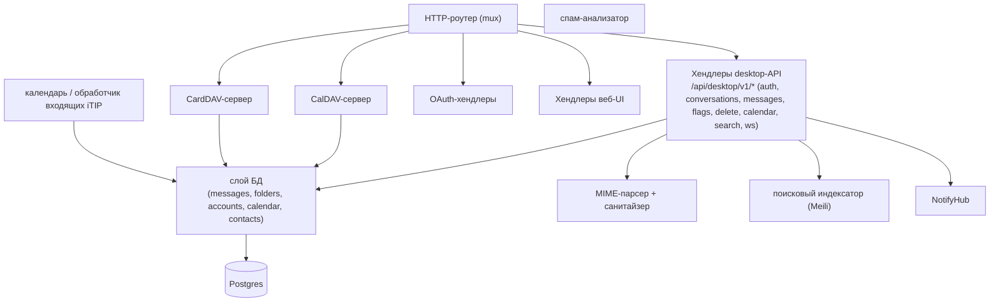
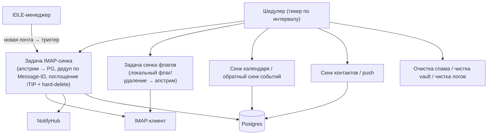
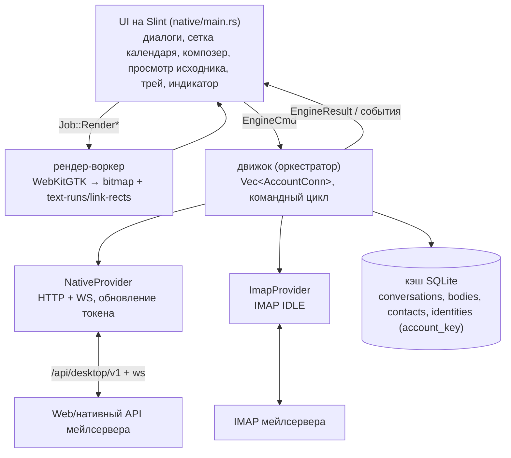

# DDMail — Архитектура C4 (уровни 1 / 2 / 3)

Снимок на 2026-06-17. Диаграммы Mermaid (рендерятся в Typora, на GitHub, в любом Mermaid-вьювере).
DDMail — это self-hosted **агрегатор почты + календаря/контактов** с
Telegram-подобным десктоп-клиентом. Один Go-бинарь зеркалит несколько
вышестоящих IMAP/CalDAV/CardDAV-аккаунтов в Postgres и отдаёт их заново
по IMAP/SMTP, нативному desktop-API (WS + HTTP), CalDAV, CardDAV и LDAP.
Десктоп-клиент на Rust/Slint общается по нативному API (с откатом на обычный IMAP).

---

## Уровень 1 — Контекст системы

---

## Уровень 2 — Контейнеры

Примечания:
- «Мейлсервер» — это **один процесс**; боксы — это параллельные слушатели/сервисы, разделяющие БД + NotifyHub, а не отдельные деплои.
- NotifyHub разводит push-события на **два потребителя**: desktop-WebSocket (`webapi`) и IMAP IDLE (`imaps`). ⚠️ см. оценку, п. 2.

---

## Уровень 3 — Компоненты

### L3a — Мейлсервер: контейнер Web / нативный API

### L3b — Мейлсервер: воркер + синк

### L3c — Десктоп-клиент

---

## Оценка архитектуры — где «скрипит»

Тревога обоснована; трение сосредоточено в нескольких несущих решениях
(все баги этой сессии сводились к одному из них):

1. **Волатильный db-`id` как идентичность письма для клиента.** desktop-API
   отдаёт `messages.id` как `uid` письма и тянет тело через `GetMessageByID`.
   Но этот id **нестабилен**: зеркало-синк апстрима, поглощение iTIP (hard-delete)
   и потоки vault/spam удаляют+пере-вставляют строки, так что только что
   отданный id может исчезнуть → висячие ссылки, пустые тела (баг Mariya/Sergey).
   **Направление фикса:** контракт клиент↔сервер должен опираться на
   **стабильный id** — RFC `Message-ID` или `(account_id, remote_folder, remote_uid)`.

2. **Два параллельных пути пуша.** Уведомления расходятся к IMAP-IDLE-клиентам
   (канал go-imap, `notifyExpunge`) *и* к десктопу (NotifyHub → WS) — но проведены
   независимо, поэтому события реализуют для одного и забывают для другого
   (удаления доходили до IMAP, но не до десктопа — чинили сегодня).
   **Направление фикса:** один источник истины событий (NotifyHub), который
   потребляют *оба* — и IMAP-сервер, и WS; IMAP-путь должен публиковать в hub,
   а не обходить его.

3. **У дельты нет семантики удалений.** Дельта диалогов сообщает *изменённые*
   треды, никогда *удалённые*; сверка полагается на полный ресинк раз в 24ч
   (или новый, триггеримый по expunge). **Направление фикса:** tombstone'ы в
   дельте, либо трактовать любое структурное изменение как «ресинк».

4. **Корень — «зеркалить всё в Postgres и пере-id'ить».** Сервер пере-сохраняет
   почту апстрима как новые строки PG со свежими id/uid. Именно это порождает
   чурн id (п.1), вопросы дубль-идентичности и дуальный контракт desktop-vs-IMAP.
   Это самое спорное место: правильна ли модель полного пере-store, или агрегатор
   должен держать апстрим-стабильные идентификаторы сквозняком?

5. **Дуальный режим клиента (native vs обычный IMAP).** Клиент может быть
   клиентом нативного API ЛИБО обычным IMAP-клиентом. Включение native-режима
   (ради календаря) обнажило дыры native-пути, которые IMAP-режим прятал.
   Работа по мультиаккаунту (P1) здорова, но стоит на шатком контракте п.1.

**Вывод:** топология для агрегатора разумная; риск — в **контракте идентичности
письма** (п.1/п.4) и **раздробленном веере уведомлений** (п.2). Оба чинятся без
ре-архитектуры — это вопросы контракта/проводки, а не структуры. Я бы сделал
стабильный message-id раньше, чем наращивать фичи на нативном API.
