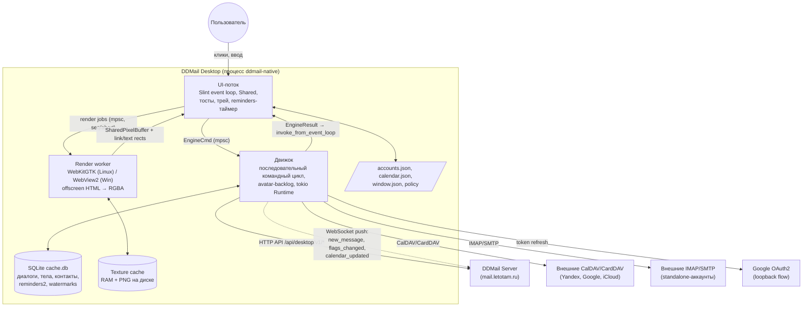
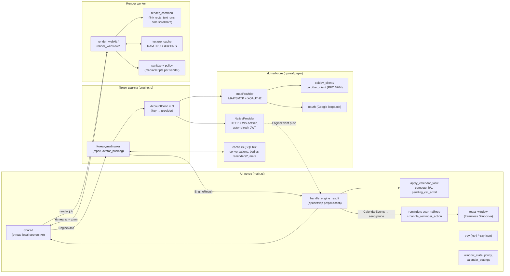
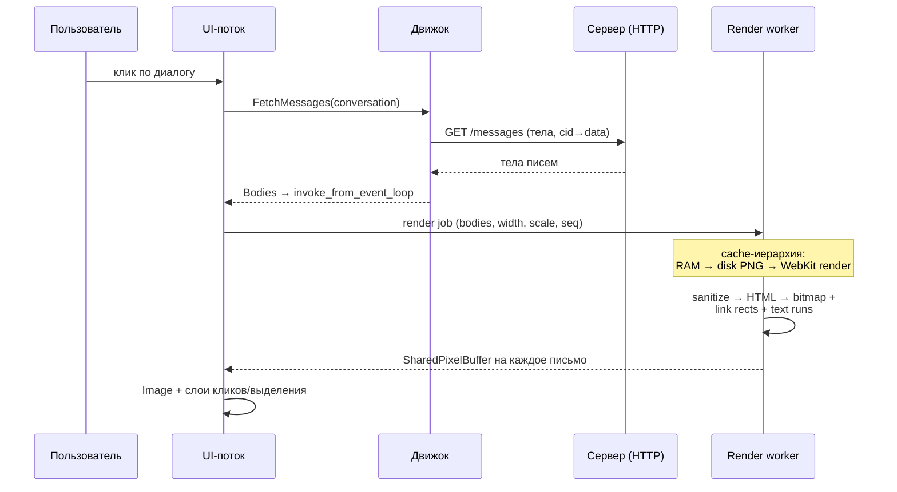
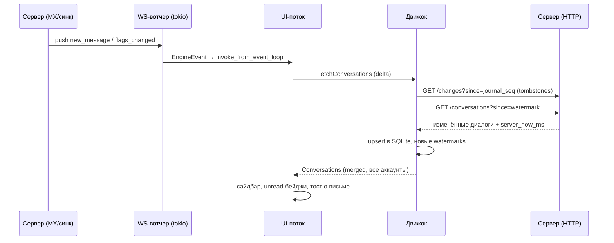
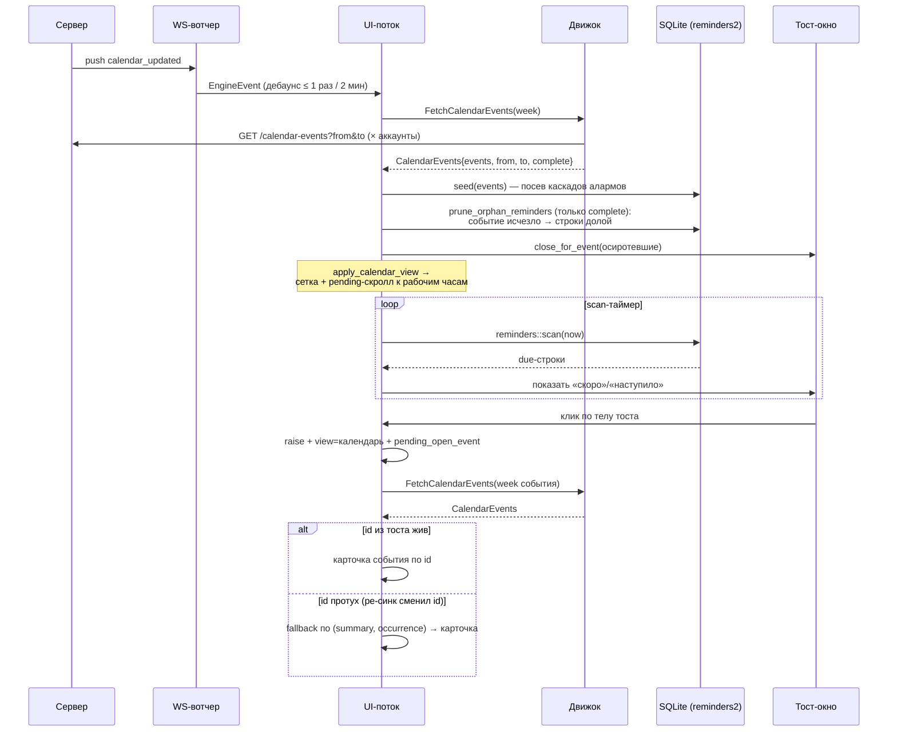

# DDMail Desktop — архитектура клиента (C2/C3 + data flow)

Дата: 2026-07-21. Код: `desktop/native` (Slint UI) + `desktop/core` (движок данных).

## Почему «однопоточный» движок

Клиент — **не** однопоточный: в процессе живёт полдюжины потоков. Однопоточным
(точнее — *последовательным*) сделан только **командный цикл движка**
(`engine.rs`): один `std::thread` крутит `mpsc`-очередь и выполняет команды
строго по одной (`rt.block_on` на каждую сетевую операцию). Это осознанный
выбор:

1. **SQLite-кэш — один писатель.** `cache.db` открыт одним соединением под
   `Mutex`. Последовательный цикл гарантирует, что запись диалогов, тел,
   watermark-ов и reminder-строк не дерётся за блокировки и не ловит
   `SQLITE_BUSY`.
2. **Стейтфул-протоколы.** IMAP-сессия имеет состояние (`SELECT`-нутая папка);
   команды к одному аккаунту обязаны идти по очереди. Параллелить = держать
   пул соединений на аккаунт — цена без выгоды при наших объёмах.
3. **Порядок результатов = корректность.** Delta-синк опирается на
   watermark-ы (`conv_since`, `journal_seq`): fetch → apply → save нового
   watermark должны быть атомарной последовательностью. Параллельные fetch-и
   могли бы записать watermark поверх более раннего незавершённого.
4. **Простота отказов.** Один цикл — одно место для обработки паник, ретраев
   и rebuild-а движка при смене конфигурации аккаунтов.

Тяжёлые и независимые вещи из цикла **вынесены**:

- **Рендер писем** — отдельный поток с WebKitGTK/WebView2 (тулкиты сами
  требуют один выделенный поток: GTK-цикл на Linux, COM STA на Windows).
- **WebSocket-вотчеры** аккаунтов — tokio-задачи на воркерах рантайма движка,
  пуши приходят независимо от очереди команд.
- **UI** никогда не ждёт движок: команды уходят в очередь, результаты
  возвращаются через `slint::invoke_from_event_loop`.

Цена последовательности проявилась 2026-07-21: ~150 аватарных HTTP-фетчей
вставали в очередь ПЕРЕД интерактивными командами календаря — «безумно
долгая загрузка». Лечение — не параллелизм, а **приоритет**: `FetchAvatar`
паркуется в `avatar_backlog` и обслуживается только при пустом канале.
Если когда-нибудь упрёмся снова — следующий шаг не «сделать всё параллельным»,
а выделить второй низкоприоритетный цикл для bulk-операций.

## Потоки процесса

| Поток | Кто создаёт | Задача |
|---|---|---|
| UI (main) | Slint | event loop, состояние `Shared`, таймеры (reminders scan, geometry saver), тост-окна |
| Engine | `engine.rs:608` | последовательный командный цикл + tokio Runtime |
| tokio workers | Runtime движка | WS-вотчеры аккаунтов (push) |
| Render worker | `main.rs` | WebKitGTK / WebView2 offscreen-рендер тел писем |
| ksni tray | `tray.rs` | D-Bus StatusNotifierItem (Linux) |
| One-shot login | по кнопке | login/OAuth без блокировки UI |

## C2 — контейнеры

## C3 — компоненты клиента

## Data flow

### Открытие диалога (рендер тел)

### Входящее письмо (push → delta)

### Календарь и напоминания (включая stale-id и удаления)

